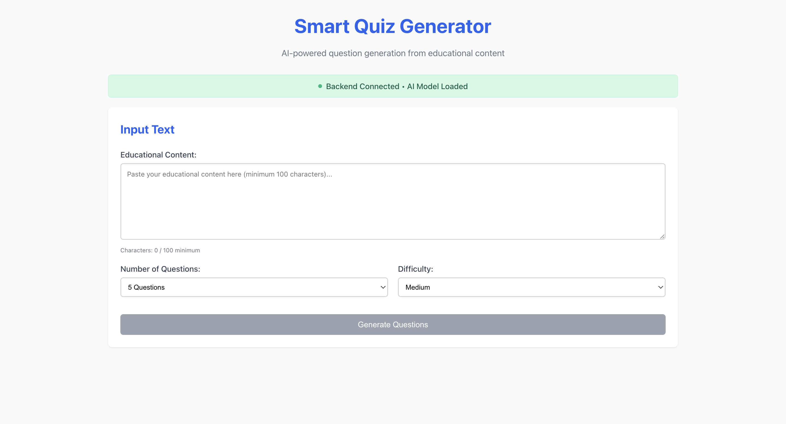
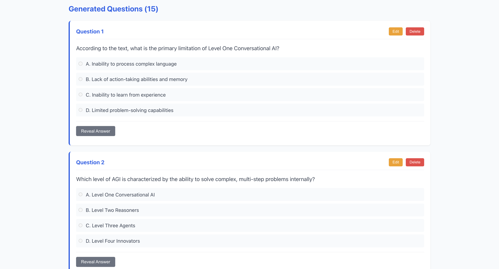
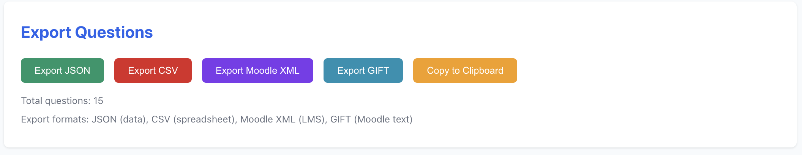

# 🧠 Smart Quiz Generator

An AI-powered educational quiz generator that creates high-quality multiple-choice questions from educational content using Google's Gemini API.


## 🌟 Features

- **🤖 AI-Powered Generation**: Uses Google Gemini API for intelligent question creation
- **📚 Multiple Difficulty Levels**: Easy, Medium, Hard, and Mixed difficulty options
- **🎯 Bloom's Taxonomy**: Questions aligned with educational learning objectives
- **📁 4 Export Formats**: JSON, CSV, Moodle XML, and GIFT formats
- **💾 Auto-Save**: Automatic localStorage backup with connection retry
- **⚡ Real-time Updates**: Live backend status monitoring
- **🗄️ Database Storage**: Persistent SQLite database for question history
- **🎨 Modern UI**: Clean, responsive React interface

## 🏗️ Architecture

```
smart-quiz-generator/
├── backend/                 # FastAPI Backend
│   ├── main.py             # API server and endpoints
│   ├── gemini_generator.py # Gemini AI integration
│   ├── models.py           # Pydantic data models
│   ├── database.py         # SQLite operations
│   ├── exporters.py        # Export functionality
│   └── requirements.txt    # Python dependencies
├── frontend/               # React Frontend
│   ├── src/
│   │   ├── components/     # React components
│   │   ├── services/       # API services
│   │   └── App.js         # Main application
│   └── public/
├── run.sh                  # Startup script
└── stop.sh                 # Shutdown script
```

## 🚀 Quick Start

### Prerequisites
- Python 3.13+
- Node.js 18+
- Google Gemini API key

### 1. Clone Repository
```bash
git clone https://github.com/YOUR_USERNAME/smart-quiz-generator.git
cd smart-quiz-generator
```

### 2. Setup Environment
```bash
# Create virtual environment
python -m venv .venv

# Create .env file
echo "GEMINI_API_KEY=your_api_key_here" > .env
```

### 3. One-Command Startup
```bash
bash run.sh
```

This will:
- ✅ Activate virtual environment
- ✅ Install Python dependencies
- ✅ Start FastAPI backend (port 8000)
- ✅ Install Node.js dependencies
- ✅ Start React frontend (port 3000)

### 4. Access Application
- **Frontend**: http://localhost:3000
- **Backend API**: http://localhost:8000
- **API Docs**: http://localhost:8000/docs

### 5. Stop Services
```bash
bash stop.sh
```

## 🎯 Usage

### Generate Questions
1. **Input Text**: Paste educational content (minimum 100 characters)
2. **Set Parameters**: Choose number of questions (1-20) and difficulty
3. **Generate**: Click "Generate Questions" to create AI-powered questions
4. **Review**: Edit or delete questions as needed
5. **Export**: Download in your preferred format

### Export Formats
- **JSON**: Machine-readable format with metadata
- **CSV**: Spreadsheet-compatible format
- **Moodle XML**: Direct import to Moodle LMS
- **GIFT**: Moodle GIFT format for question banks

## 🔧 API Endpoints

| Method | Endpoint | Description |
|--------|----------|-------------|
| `GET` | `/api/health` | Check backend status |
| `POST` | `/api/generate-questions` | Generate new questions |
| `POST` | `/api/validate-questions` | Validate question quality |
| `GET` | `/api/export/{format}` | Export questions |

### Sample API Request
```json
{
  "text": "Artificial Intelligence is a branch of computer science...",
  "num_questions": 5,
  "question_type": "multiple_choice",
  "difficulty": "medium"
}
```

## 🛠️ Development

### Backend Development
```bash
# Activate environment
source .venv/bin/activate

# Install dependencies
pip install -r backend/requirements.txt

# Run backend only
cd backend && python main.py
```

### Frontend Development
```bash
# Install dependencies
cd frontend && npm install

# Run frontend only
npm start
```

### Environment Variables
Create `.env` file in project root:
```env
GEMINI_API_KEY=your_gemini_api_key_here
```

## 📦 Dependencies

### Backend
- FastAPI 0.104.1 - Modern web framework
- google-generativeai 0.8.5 - Gemini API client
- python-dotenv 1.1.1 - Environment management
- SQLite - Database storage

### Frontend
- React 18.0 - UI framework
- Modern CSS - Responsive styling
- Fetch API - HTTP requests

## 🎨 Screenshots

### Main Interface


### Question Generation


### Export Options


## 📊 Performance

- **Generation Speed**: 2-5 seconds per question
- **Concurrent Users**: Supports multiple simultaneous users
- **Storage**: ~1KB per question in database
- **Memory Usage**: ~50MB backend, ~30MB frontend

## 🔒 Security

- ✅ API key stored in environment variables
- ✅ Input validation and sanitization
- ✅ Rate limiting protection
- ✅ Secure CORS configuration
- ✅ No sensitive data in git repository

## 🐛 Troubleshooting

### Common Issues

**Backend not connecting:**
```bash
# Check if virtual environment is activated
source .venv/bin/activate

# Verify Gemini API key
echo $GEMINI_API_KEY
```

**Frontend connection errors:**
```bash
# Check backend is running on port 8000
curl http://localhost:8000/api/health
```

**Export issues:**
- Ensure questions are generated before exporting
- Check browser's downloads folder
- Verify backend database has questions

## 🤝 Contributing

1. Fork the repository
2. Create feature branch (`git checkout -b feature/amazing-feature`)
3. Commit changes (`git commit -m 'Add amazing feature'`)
4. Push to branch (`git push origin feature/amazing-feature`)
5. Open Pull Request

## 📝 License

This project is licensed under the MIT License - see the [LICENSE](LICENSE) file for details.

## 🙏 Acknowledgments

- **Google Gemini AI** - Intelligent question generation
- **FastAPI** - High-performance web framework
- **React** - Modern frontend framework
- **SQLite** - Reliable database engine

## 📞 Support

- **Issues**: [GitHub Issues](https://github.com/YOUR_USERNAME/smart-quiz-generator/issues)
- **Discussions**: [GitHub Discussions](https://github.com/YOUR_USERNAME/smart-quiz-generator/discussions)

---

**Made with ❤️ for educators and learners worldwide**
